# 消息中间件实战高手


## 1. 订单系统的技术挑战

### 1.1 业务流程

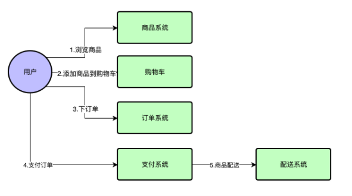


+ 当用户对购物车中选中的一批商品确认下单的时候，会先出来一个确认订单的界面
+ 用户得先确认这个订单中的商品、价格、运费无误，而且在这个过程中可以选择是否要使用优惠券、促销活动的。
+ 用户还应该在这个界面中确认自己的快递方式，收件地址，是否要开发票以及发票的抬头是什么。
+ 当用户完成这些信息确认之后，就可以确定下单。


### 1.2 系统流程

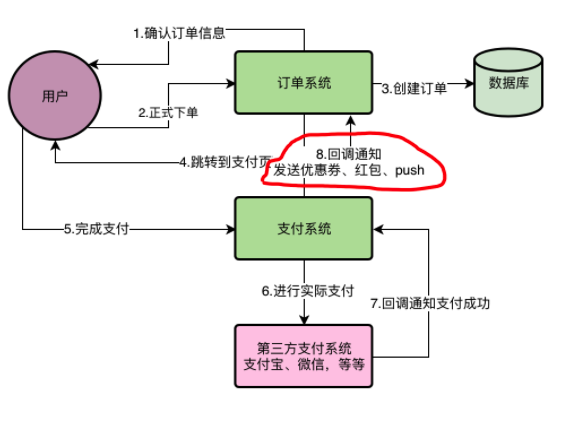

订单系统最核心的一个环节就出现了，就是要根据APP端传递过来的种种信息，完成订单的创建，此时需要在数据库中创建对应的订单记录，

+ 正式确认下单之后，除了在数据库中创建这个订单之外
+ 会跳转到支付界面，让你通过选择好的支付方式完成这个订单的支付。比如跳转到支付宝或者微信，让你在支付宝或者微信中完成支付，
+ 在完成了支付之后，一般来说，支付宝或者微信之类的支付系统，会反过来回调我们的一个接口，通知我们本次支付已经成功。
+ 当我们收到支付成功的通知之后，就需要安排给用户进行配送发货。
+ 因为一般电商APP都经常会做一些鼓励用户购买的活动，比如你购买之后送一些优惠券，下次购买可以抵用5块钱，或者给你发一个几块钱的现金红包。此外，还会给你发送一个push推送，通知你支付成功准备发货，这个推送很多时候是通过短信通知的。


### 1.3 核心模块

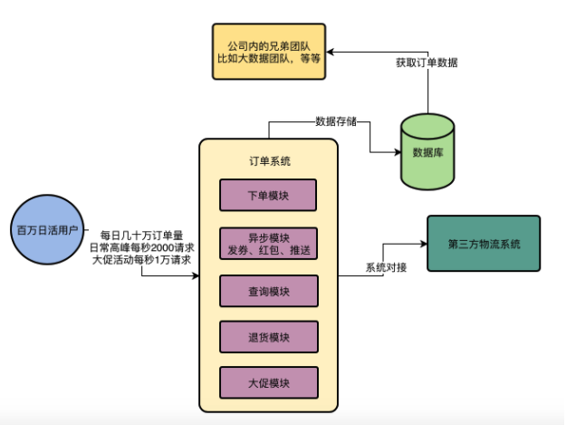

+ 首先订单系统在完成核心的下单业务流程之后，用户一定会**查询订单**，那么订单系统务必要提供对应的订单查询功能。
+ **下单模块**主要是用于创建订单
+ **异步模块**主要是在支付成功之后发优惠券、红包和推送，查询模块主要是提供订单的查询。
+ 订单系统中也得提供**退货功能**，在下面的图中我们加入退货模块。
+ 订单系统跟**第三方系统的对接。**
+ 订单数据是一个公司的核心数据，很多时候公司内部的其他团队，比如**大数据团队可能就需要获取订单数据进行分析**
+ 在类似双11、秒杀等大促场景下，等待一些特价促销的商品开卖之后进行抢购，此时可能会对订单系统会产生一个流量洪峰，甚至影响正常的一些下单功能。往往要提供一个专门用于抗双11、秒杀等活动的**大促模块，专门用于处理特殊活动下的高并发下单场景**


### 1.4 系统压力

活跃的用户数量是一两百万的样子，然**后每天新增的订单数量，目前大概是几十万的样子**。

在一些双11、618等大促活动的时候，我们现在的订单系统就可以达到单日**百万订单的量级了**，所以我们的系统压力还是比较大的。

QPS，也就是系统每秒的查询数量，这个指标是说订单系统所有的核心以及非核心功能模块加起来，每秒钟有多少请求量。

+ 在往常每天的高峰期，大概最多会达到**每秒2000左右的访问量**，不算太大。

+ 但是如果要是有那种特价商品限时秒杀的活动，那**可能就会达到每秒1万以上的访问压力**了。

  

压力主要在两方面：

- 一方面是订单系统日益增长的数据量
- 一方面是在大促活动时每秒上万的访问压力


### 1.5 性能瓶颈

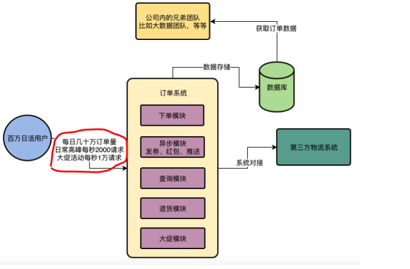


系统每天高峰期**大概会有2000左右的QPS,也就是每秒会有2000左右的请求过来,这就是当前系统的个最大压力**。在非高峰的时候,其实远远达不到这么高的并发,所以先考志高峰期的压力就可以了。

一个系统的工程师来说,应该了解的事情就是你的APP用户的生活习惯和APP的使用习惯，这些用户的使用惯直接决定了他们使用我们APP的频率，时间段和时长。


通过线上ー些数据的统计，**我们大致知道,咱们这个APP,基本上80%的用户都习惯于在晩上六点过后到凌晨十ー点这几个小时使用**，所以在这儿个小时内,可以认为有80万左石的用户会使用APP。因此对我们订单系统而言，主要的访问量就是下订单以及对订单的索，査询，少量的退款等渠作。


因为我们的电商AP有两个特点，第一，真实的系统访问负载应该是一个半园形的曲线,类似下面这样。

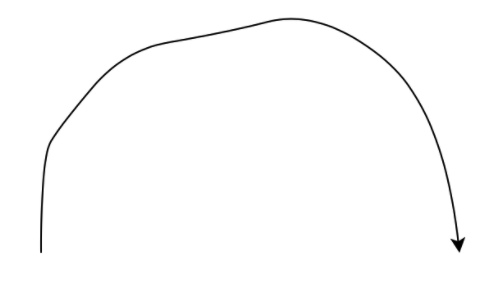


比如从晚上6点开始访问量开始加，一直到可能晚上把几点到一个顶点,访问是最大的然后慢慢的开始下落,到上十一点就变得较低。

现在线上的**订单系统一共部署了8台机器,每台机器的配置是4核8G**。因此高峰期每台机器的请求大概是每秒200~300之间。

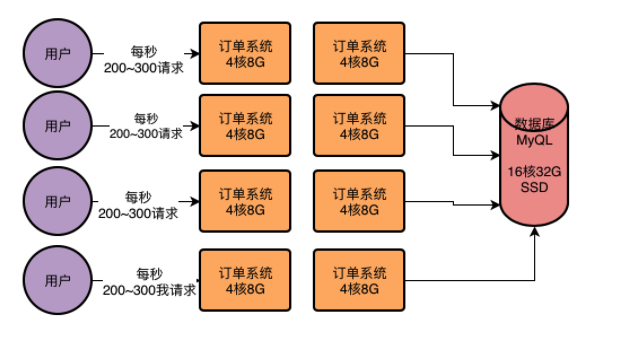


但是这8台订单系统部署的服务器都是连接一台数据库服务器的,**数据库服务器的配置是16核32G**,而且是SSD同态硬莅的,用的是比
较高配置比较贵的机器,因此性能会更好一些。

现在线上这样的一个机器部著情況,**在高峰期毎秒2000以上请求的情況下是很轻松可以抗住的**。因为4核8G的机器一般每秒钟抗几百请求都没

然后数据库服务器因为用的是**16核32G的配置,因此之前压测的时候知道他即使每秒上万请求也能做到,只不过那个已经是他的极限**了,会导致数据库服务器的CPU，磁盘，网络，IO，内存的使用率几乎达到极限。现在数据库服务器在高峰期的每秒请求量也就是三四千的样子因此基本上还没什么大问题。

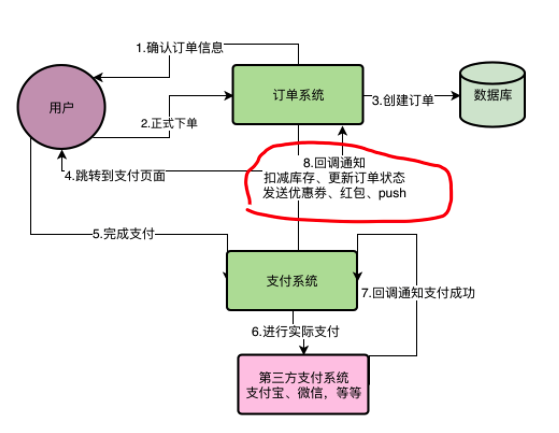

这八个步骤全部执行完，加起来大概需要1秒~2秒的时间。**高峰期数据库的负载较高，会导致数据库磁盘，IO, CPU负载很高，导致数据库执行SQL语句下降**，导致用户等待时间过长。


### 1.6 技术难点

#### 第三方系统耦合度高

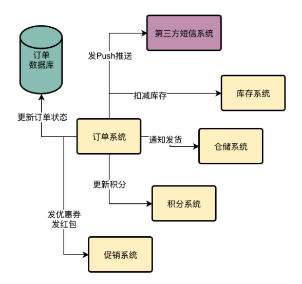


订单退款应该是一个订单支付的逆向过程，也就是说他应该做如下一些事：

+ 重新给商品增加库存
+ 更新订单状态为“已完成”
+ 减少你的积分
+ 收回你的优惠券和红包
+ 发送Push告诉你退款完成了
+ 通知仓储系统取消发货
+ 需要通过第三方支付系统把钱重新退还给你。

那这个退款流程太长，子步骤过多，如果用户点击退款之后要一下子执行这么多步骤，可能需要好几秒的时间，用户体验同样是很差的！

**有可能是第三方支付系统自己的问题导致退款失败**，也可能是你在调用第三方支付系统的时候，因为你自己的网络问题导致调用失
败，就退款失败了。

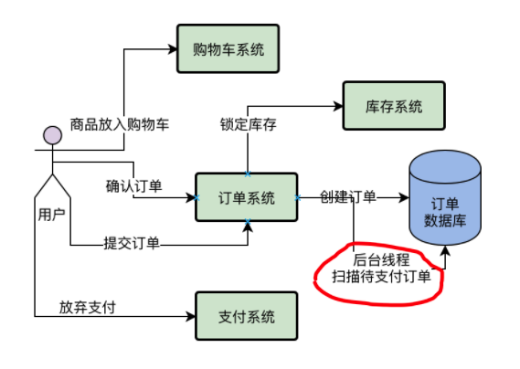

如果发现超过24小时还没付款，**就直接把订单状态改成“已关闭”了，释放掉锁定的那些商品库存**。假设咱们现在数据库中积压了几十万笔待支付的订单，**难道你要求一个后台线程不停的去扫描这几十万笔订单吗？这个效率明显是很低的啊！**


#### 大数据查询订单数据

想知道昨天一共有多少个用户在我们这里购买了商品？一共有多少笔订单？每个商品分别卖了多少件？哪个商品是打印最火爆卖的最好的？我们的APP昨天有多少人打开了？打开APP的人里有多少人下订单购物了？我们昨天的毛利润一共有多少（就是营业额扣除掉商品本身的成本之后的毛利，如果你用毛利再减去公司运营的成本，比如300个员工的工资，公司房租、水电等等，再交完税，就是老板和股东的净利润了）？

昨天下订单购物的人里，老用户有多少人（就是以前在你这里注册过或者购物过的，这些算老用户）？新用户有多少人（就是第一次下载你的APP，注册之后立马就购物的用户）？才能继续去考虑公司的运营策略。

大数据团队收集数，比如用户搜索了什么东西，点击了什么东西，评论了什么东西。还有就是搜集用户在APP里的交易数据，比如最核心的一种订单数据。订单数据就直观的代表了用户在APP里的所有的交易。然后大数据团队搜集过来大量的数据之后，就形成了所谓的“大数据”。接着他用这些大数据可以计算出很多东西。

最常见的就是数据报表，比如说用户行为报表，订单分析报表。

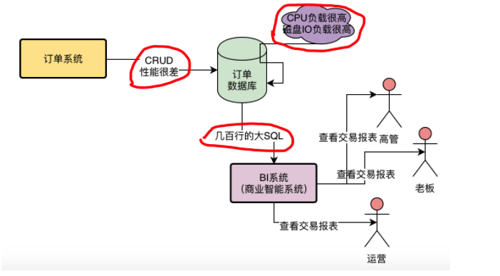


大数据团队从我们这里提取数据，已经严重影响到我们订单系统的运行了。现在我们的订单数据库，是直接对外暴露的，大数据团队是直接可以访问我们的订单数据库的。

他们有一个数据报表系统，那个系统每次在老板查看交易报表的时候，就会直接用一个几百行的大SQL，从我们的订单数据库里查出来
需要的数据！**数据报表系统运行一个几百行的大SQL到我们库里，这种级别的SQL在这种量级下，快则三五秒，慢则几十秒！**

每次当有几十个几百行的大SQL同时运行在我们订单数据库里的时候，**都会导致我们的数据库CPU负载很高，磁盘IO负载很高！**一旦我们的数据库负载很高，**直接会导致我们的订单系统执行的一些增删改查的操作性能大幅度下降！**


#### 促销活动的洪峰流量

如每秒订单系统的各类接口被调用2000次，平均每个接口会执行多少次数据库操作？一般你可以认为平均每个接口会执行2~3次的数据库操作。

一般一个接口根据业务复杂度的不同，有的接口可能处理一个请求要执行五六次数据库操作，有的接口可能是1次数据库操作+两三个其他系统的接口调用（比如库存系统、营销系统）。总之，一般来说，业务系统的接口处理逻辑，基本都集中在对自己的数据库的操作以及对其他系统的调用上。

所以大致在我们这里，结合线上数据库的可视化监控界面，基本可以知道，**平均每次订单系统的接口调用，会执行2次数据库操作，我们观察数据库的监控界面，在最高峰的时候，每秒大概是有4000左右的请求。**


公司现在积累的注册用户已经千万级了，平时的日活用户都百万级，今年的双11参与活动的用户预计有可能会达到两三百万。假设是这个量级的话，基本可以做一个设想，如果有200万用户参与双11活动，在双11购物最高峰的时候，肯定会比往年的高峰QPS高好几倍，预计有可能今年双11最高峰的时候，会达到每秒至少1万的QPS。

也就是说，光**是系统被请求的QPS就会达到1万以上，那么系统请求数据库的QPS就会达到2万以上**。仅仅凭借我们目前的数据库性能，是无论如何扛不住每秒2万请求的。

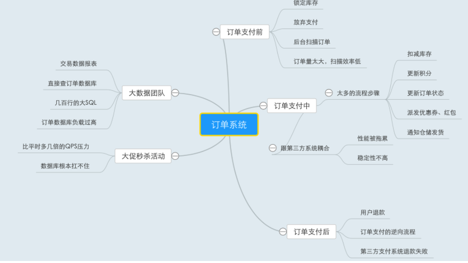


## 2. Rocket MQ 生产部署架构

### 2.1 MQ核心功能

#### 异步

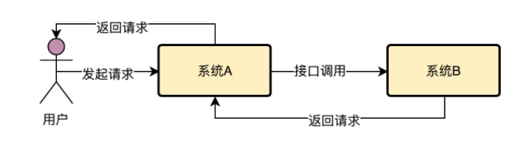

那么在这种情况下，用户发起一个请求，系统A收到请求，接着系统A必须立马去调用系统B，直到系统B返回了，系统A才能返回结果给用户，**这种模式其实就是所谓的“同步调用”**。

“消息中间件”叫MQ就行了，英文全称就是“Message Queue”，也就是消息队列。

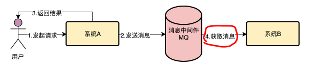


一个核心的概念就是“消息”。所以系统A一般会发送一个消息给MQ。

+ 系统A就认为自己的工作干完了，然后就直接返回结果给用户了。
+ 系统B根据自己的情况，可能会在系统A投递消息到MQ之后的1秒内，也可能是1分钟之后，也可能是1小时之后，多长时间都有可能，反正不管是多长时间后，系统B肯定会从MQ里获取到一条属于自己的消息。然后获取到消息之后，根据消息的指示再完成自己的工作。


#### 解耦

现在假设系统A要调用系统B干一个事儿，然后系统A先执行一些操作，需要耗费20ms，接着系统B执行一些操作要耗费200ms，总共就要耗费220ms。给用户要等待220ms。

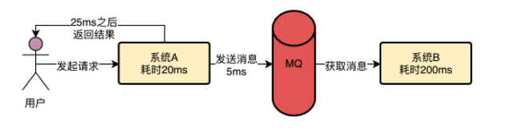

那么如果在系统A和系统B之间加一个MQ。系统A干完自己的事情，就20ms，然后发送一个消息到MQ，就5ms，然后就直接返回结果给用户了。也就是说，用户仅仅等待25ms就收到了结果。


#### 削峰

然后系统B是要操作一台数据库服务器的，**那台数据库的上限是接收每秒6000请求**，那么系统B无论部署多少台机器都没用，因为他依赖的数据库最多只能接收每秒6000请求。

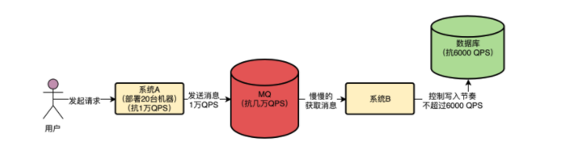

现在假设大量用户同时发起访问，系统A会瞬间把1万QPS转发给系统B，假设你系统B也部署20台机器，系统B自己可以抗住1万QPS，**数据库是抗不下来1万QPS的**，此时系统B如果对数据库发起1万QPS的请求，一定会瞬间压垮数据库的。

+ MQ这个技术抗高并发的能力远远高于数据库，同样的机器配置下，如果数据库可以抗每秒6000请求，MQ至少可以抗每秒几万请求。

+ 数据库他要能够支持你执行复杂的SQL语句，支持事务等复杂的机制，支持你对数据进行增删改查，所以一**般数据库单服务器也就支撑每秒几千的请求。**

系统b只要慢慢的从MQ里获取消息然后执行数据库读写操作即可，这个**获取消息的速度是系统B自己可以控制的**，所以系统B完全可以用一个比较低的速率获取消息然后写入数据库，保证对数据库的QPS不要超过他的极限值6000。


### 2.2 MQ选型

#### Kafka的优势和劣势

**Kafka的吞吐量几乎是行业里最优秀的**，在常规的机器配置下，一台机器可以达到每秒十几万的QPS，相当的强悍。

Kafka性能也很高，基本上**发送消息给Kafka都是毫秒级的性能。可用性也很高**，Kafka是可以支持集群部署的，其中部分机器宕机是可以继续运行的。

**Kafka有丢数据方面的问题**，因为Kafka收到消息之后会写入一个磁盘缓冲区里，并没有直接落地到物理磁盘上去，所以要是机器本身故障了，可能会导致磁盘缓冲区里的数据丢失。

**Kafka功能非常的单一**，主要是支持发送消息给他，然后从里面消费消息，其他就没有什么额外的高级功能了。所以基于Kafka有限的功能，可能适用的场景并不是很多。

因此综上所述，以及查阅了Kafka技术在各大公司里的使用，基本行业里的一个标准，是把Kafka用在用户行为日志的采集和传输上，比如大数据团队要收集APP上用户的一些行为日志，这种日志就是用Kafka来收集和传输的。而且一般量特别大，要求吞吐量要高，一般就是收发消息，不需要太多的高级功能，所以Kafka是非常适合这种场景的。


#### RabbitMQ的优势和劣势

**RabbitMQ的优势在于可以保证数据不丢失，也能保证高可用性**，即集群部署的时候部分机器宕机可以继续运行，然后**支持部分高级功能，比如说死信队列，消息重试之类的**，这些是他的优点。

**RabbitMQ的吞吐量是比较低的**，一般就是每秒几万的级别，所以如果遇到特别特别高并发的情况下，支撑起来是有点困难的。

另外还有一个较为致命的缺陷，就是他的开发语言是erlang，国内很少有精通erlang语言的工程师，因此也没办法去阅读他的源代码，甚至修改他的源代码。

很多中小型公司觉得RabbitMQ基本可以满足自己的需求还在继续使用中，因为中小型公司并不需要特别高的吞吐量，RabbitMQ已经足以满足他们的需求了，而且也不需要部署特别大规模的集群，也没必要去阅读和修改RabbitMQ的源码。


#### RocketMQ的优势和劣势

RocketMQ是阿里开源的消息中间件，他几乎同时解决了Kafka和RabbitMQ的缺陷。

**RocketMQ的吞吐量也同样很高，单机可以达到10万QPS以上，而且可以保证高可用性，性能很高**，而且支持通过配置保证数据绝对不丢失，可以部署大规模的集群，还支持各种高级的功能，比如说**延迟消息、事务消息、消息回溯、死信队列、消息积压**，等等。

**RocketMQ是基于Java开发的**，符合国内大多数公司的技术栈，很容易就可以阅读他的源码，甚至是修改他的源码。所以现在国内很多一线互联网大厂都切换为使用RocketMQ了，他们需要RocketMQ的高吞吐量，大规模集群部署能力，以及各种高阶的功能去支撑自己的各种业务场景，同时还可以根据自己的需求定制修改RocketMQ的源码。

RocketMQ是非常适合用在Java业务系统架构中的，因为他很高的性能表现，还有他的高阶功能的支持，可以让我们解决各种业务问题。

RocketMQ的官方文档相对简单一些，但是Kafka和RabbitMQ的官方文档就非常的全面和详细，这可能是RocketMQ目前唯一的缺点。

| Messaging Product | Client SDK           | Protocol and Specification                           | Ordered Message                                              | Scheduled Message | Batched Message                                 | BroadCast Message | Message Filter                                          | Server Triggered Redelivery | Message Storage                                              | Message Retroactive                          | Message Priority | High Availability and Failover                               | Message Track | Configuration                                                | Management and Operation Tools                               |
| :---------------- | :------------------- | :--------------------------------------------------- | :----------------------------------------------------------- | :---------------- | :---------------------------------------------- | :---------------- | :------------------------------------------------------ | :-------------------------- | :----------------------------------------------------------- | :------------------------------------------- | :--------------- | :----------------------------------------------------------- | :------------ | :----------------------------------------------------------- | :----------------------------------------------------------- |
| ActiveMQ          | Java, .NET, C++ etc. | Push model, support OpenWire, STOMP, AMQP, MQTT, JMS | Exclusive Consumer or Exclusive Queues can ensure ordering   | Supported         | Not Supported                                   | Supported         | Supported                                               | Not Supported               | Supports very fast persistence using JDBC along with a high performance journal，such as levelDB, kahaDB | Supported                                    | Supported        | Supported, depending on storage,if using kahadb it requires a ZooKeeper server | Not Supported | The default configuration is low level, user need to optimize the configuration parameters | Supported                                                    |
| Kafka             | Java, Scala etc.     | Pull model, support TCP                              | Ensure ordering of messages within a partition               | Not Supported     | Supported, with async producer                  | Not Supported     | Supported, you can use Kafka Streams to filter messages | Not Supported               | High performance file storage                                | Supported offset indicate                    | Not Supported    | Supported, requires a ZooKeeper server                       | Not Supported | Kafka uses key-value pairs format for configuration. These values can be supplied either from a file or programmatically. | Supported, use terminal command to expose core metrics       |
| RocketMQ          | Java, C++, Go        | Pull model, support TCP, JMS, OpenMessaging          | Ensure strict ordering of messages,and can scale out gracefully | Supported         | Supported, with sync mode to avoid message loss | Supported         | Supported, property filter expressions based on SQL92   | Supported                   | High performance and low latency file storage                | Supported timestamp and offset two indicates | Not Supported    | Supported, Master-Slave model, without another kit           | Supported     | Work out of box,user only need to pay attention to a few configurations | Supported, rich web and terminal command to expose core metrics |


### 2.3 RocketMQ架构原理

#### 高并发

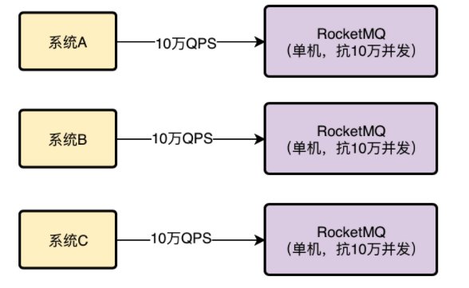

RocketMQ是可以集群化部署的，可以部署在多台机器上。假设每台机器都能抗10万并发，然后你只要让几十万请求分散到多台机器上就可以了，让每台机器承受的QPS不超过10万不就行了。


#### 分布式存储

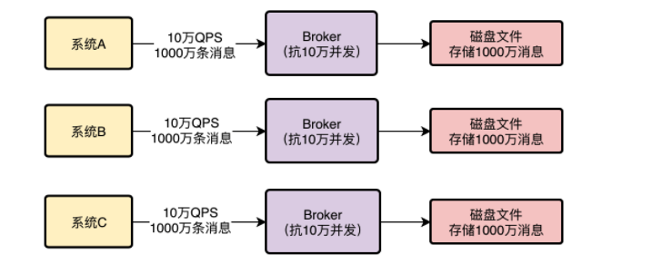

RocketMQ存储海量消息的机制就是分布式的存储。所谓分布式存储，就是把数据分散在多台机器上来存储，每台机器存储一部分消息，这样多台机器加起来就可以存储海量消息了！


#### 高可用

RocketMQ的解决思路是Broker主从架构以及多副本策略。

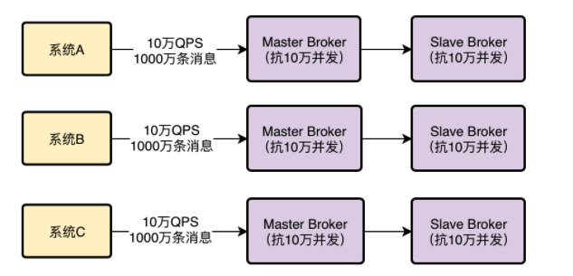

Master Broker收到消息之后会同步给Slave Broker，这样Slave Broker上就能有一模一样的一份副本数据。这样同一条消息在RocketMQ整个集群里不就有两个副本了，一个在Master Broker里，一个在Slave Broker里！

这个时候如果任何一个Master Broker出现故障，还有**一个Slave Broker上有一份数据副本，可以保证数据不丢失**，还能继续对外提供服务，保证了MQ的可靠性和高可用性


#### 数据路由

RocketMQ有一个NameServer的概念，他也是独立部署在几台机器上的，然后所有的Broker都会把自己注册到NameServer上去，NameServer就知道集群里有哪些Broker了。

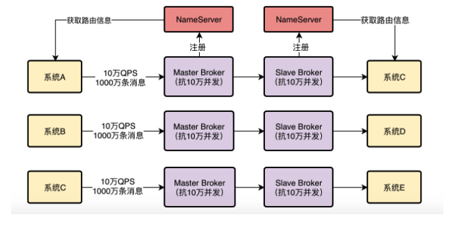

然后对于我们的系统而言，如果他要发送消息到Broker，会找NameServer去获取路由信息，就是集群里有哪些Broker等信息


### 2.4 路由中心

NameServer一定会多机器部署，实现一个集群，起到高可用的效果，保证任何一台机器宕机，其他机器上的NameServer可以继续对外提供服务！**每个Broker启动都得向所有的NameServer进行注册**

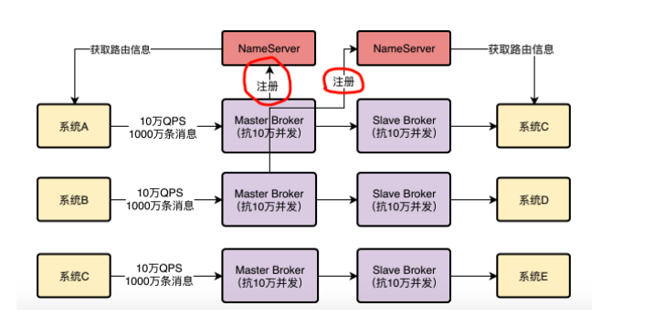

RocketMQ中的生产者和消费者就是这样，**自己主动去NameServer拉取Broker信息的**。

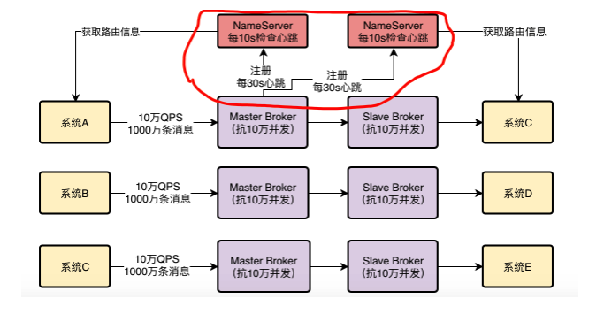

每个NameServer都知道集群里有这么一台Broker的存在了，**然后各个系统从NameServer那儿也拉取到了Broker信息**，也知道集群里有这么一台Broker

**Broker跟NameServer之间有心跳机制**，Broker会每隔30s给所有的NameServer发送心跳，告诉每个NameServer自己目前还活着。120s没发心跳给NameServer，就认为broker宕机了。


### 2.5 主从架构

#### 主从复制

先来看第一个问题，我们都知道，为了保证MQ的数据不丢失而且具备一定的高可用性，所以一般都是得将Broker部署成Master-Slave模式的，也就是一个Master Broker对应一个Slave Broker

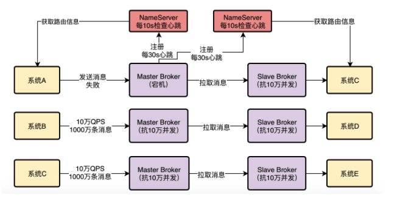

RocketMQ的Master-Slave模式采取的是**Slave Broker不停的发送请求到Master Broker去拉取消息**。


#### 读写分离

**有可能从Master Broker获取消息，也有可能从Slave Broker获取消息**

作为消费者的系统在获取消息的时候会先发送请求到Master Broker上去，请求获取一批消息，此时Master Broker是会返回一批消息给消费者系统的

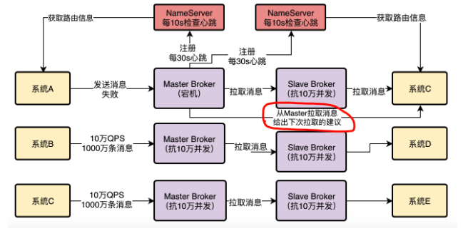

​       

然**后Master Broker在返回消息给消费者系统的时候，会根据当时Master Broker的负载情况和Slave Broker的同步情况，向消费者系统建议下一次拉取消息的时候是从Master Broker拉取还是从Slave Broker拉取**。


+ 例子一，Master Broker负载很重，本身要抗10万写并发了，你还要从他这里拉取消息，给他加重负担，那肯定是不合适的。所以此时Master Broker就会建议你从Slave Broker去拉取消息。
+ 例子二，Master Broker上都已经写入了100万条数据了，结果Slave Broke不知道啥原因，同步的特别慢，才同步了96万条数据，落后了整整4万条消息的同步，这个时候你作为消费者系统可能都获取到96万条数据了，那么下次还是只能从Master Broker去拉取消息。因为Slave Broker同步太慢了，导致你没法从他那里获取更新的消息了。


#### 主备切换

RocketMQ 4.5版本之前，都是用Slave Broker同步数据，尽量保证数据不丢失，但是一旦Master故障了，Slave是没法自动切换成Master

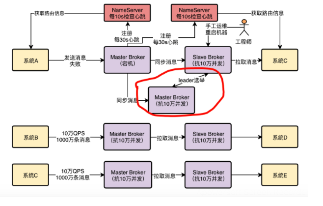

在RocketMQ 4.5之后，因为RocketMQ支持了一种新的机制，叫做**Dledger**，基于Raft协议实现的一个机制。

旦Master Broker宕机了，就可以在多个副本，也就是多个Slave中，**通过Dledger技术和Raft协议算法进行leader选举**，直接将一个Slave Broker选举为新的Master Broker，**然后这个新的Master Broker就可以对外提供服务了**。整个过程也许只要10秒或者几十秒的时间就可以完成。


### 2.6 高可用生产架构

#### NameServer集群化部署，保证高可用性

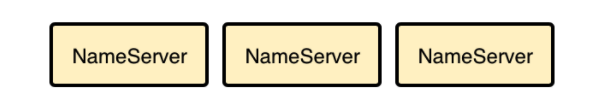

首先第一步，我们要让NameServer集群化部署，我建议可以部署在三台机器上，这样可以充分保证NameServer作为路由中心的可用性，哪怕是挂掉两台机器，只要有一个NameServer还在运行，就能保证MQ系统的稳定性


#### 基于Dledger的Broker主从架构部署

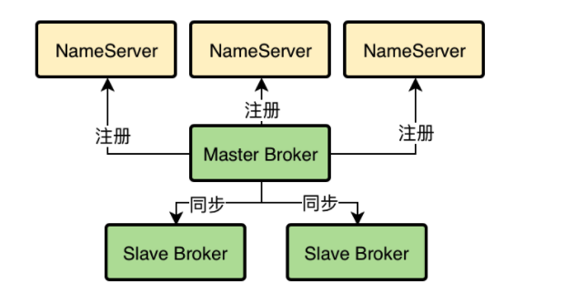

Dledger技术是要求至少得是一个Master带两个Slave，这样有三个Broke组成一个Group，也就是作为一个分组来运行。一旦Master宕机，他就可以从剩余的两个Slave中选举出来一个新的Master对外提供服务。


#### Broker跟NameServer进行通信

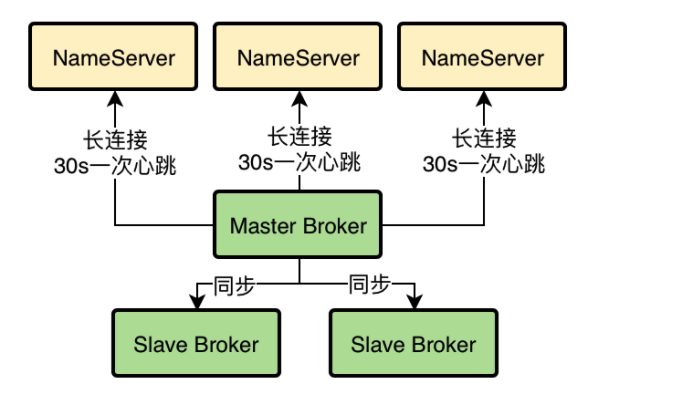

Broker会每隔30秒发送心跳到所有的NameServer上去，然后每个NameServer都会每隔10s检查一次有没有哪个Broker超过120s没发送心跳的。Broker会跟每个NameServer都建立一个TCP长连接，然后定时通过TCP长连接发送心跳请求过去


#### MQ的核心数据模型Topic

MQ中的核心数据模型，Topic。在你的订单系统需要往MQ里发送订单消息，那么此时你就应该建一个Topic，他的名字可以叫做：topic_order_info，也就是一个包含了订单信息的数据集合。

Topic其实就是一个数据集合的意思，不同类型的数据你得放不同的Topic里去。

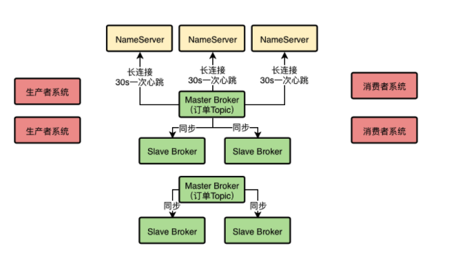

比如我们有一个订单Topic，可能订单系统每天都会往里面投递几百万条数据，然后这些数据在MQ集群上还得保留好多天，那么最终可能会有几千万的数据量，**这还只是一个Topic。那么如果有很多的Topic，并且里面都有大量的数据，最终加起来的总和也许是一个惊人的数字，此时这么大量的数据本身是不太可能存放在一台机器上的**。

我们可以在创建Topic的时候指定让他里面的数据分散存储在多台Broker机器上，**比如一个Topic里有1000万条数据，此时有2台Broker，那么就可以让每台Broker上都放500万条数据。**


#### 生产者发送消息给Broker

生产者系统在发送消息之前，得先有一个Topic，然后在发送消息的时候你得指定你要发送到哪个Topic里面去。

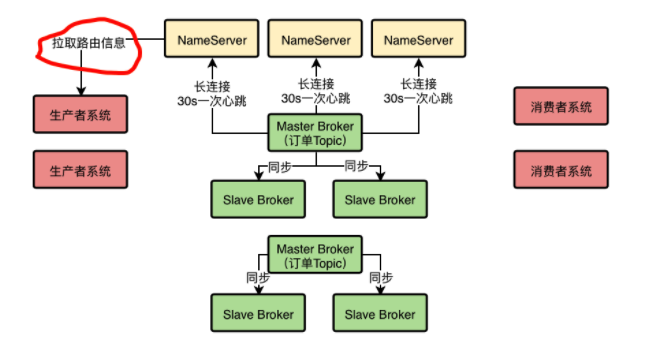

**跟NameServer建立一个TCP长连接，然后定时从他那里拉取到最新的路由信息**，包括集群里有哪些Broker，集群里有哪些Topic，每个Topic都存储在哪些Broker上。此时可以根据负载均衡算法，从里面选择一台Broke机器出来，比如round robine，hash算法。


#### 消费者从Broker上拉取消息

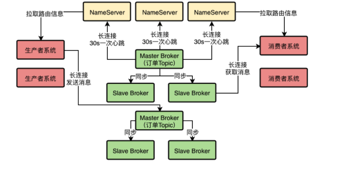

**消费者**系统其实跟生产者系统原理是类似的，**他们也会跟NameServer建立长连接，然后拉取路由信息**，接着找到自己要**获取消息的Topic在哪几台Broker上，就可以跟Broker建立长连接，从里面拉取消息了**

+ Broker随便挂了一台机器也不怕，挂了Slave对集群没太大影响，**挂了Master也会基于Dledger技术实现自动Slave切换为Master**
+ 生产者系统和消费者集群化部署的
+ **集群可以抗下高并发**，因为假设订单系统对订单Topic要发起**每秒10万QPS的写入**，那么只要订单Topic分散在比如5台Broker上，**实际上每个Broker会承载2万QPS写入**，也就是说高并发场景下的10万QPS可以分散到多台Broker上抗下来。
+ **集群足以存储海量消息**，因为所有**数据都是分布式存储的**，每个Topic的数据都是存储在多台Broker机器上的，用集群里多台Master Broker就足以存储海量的消息。
+ 多个Master Broker部署的方式，加上Topic分散在多台Broker上的机制，可以抗下高并发访问以及海量消息的分布式存储。然后每个Master Broker有两个Slave Broker结合Dledger技术可以实现故障时的自动Slave-Master切换，**实现高可用性。**

最后，这套架构还具备伸缩性，就是说如果要抗更高的并发，存储跟多的数据，完全可以在集群里加入更多的Broker机器，这样就可以线性扩展集群了。


### 2.7 开发环境快速部署

在机器上部署RocketMQ之前，先安装一下JDK，同时要在环境变量中设置Java_HOME，这个小猛很熟练就搞定了。（画外音，如果有不会的同学，可以自己查阅资料）

接着在一台机器上执行了下面的命令来构建Dledger：

```shell
git clone https://github.com/openmessaging/openmessaging-storage-dledger.git
cd openmessaging-storage-dledger
mvn clean install -DskipTests
```


执行了下面的命令来构建RocketMQ：

```shell
git clone https://github.com/apache/rocketmq.git
cd rocketmq
git checkout -b store_with_dledger origin/store_with_dledger
mvn -Prelease-all -DskipTests clean install -U
```


接着进入apache-rocketmq目录中：

```shell
cd distribution/target/apache-rocketmq
```


在这个目录中，需要编辑三个文件，一个是bin/runserver.sh，一个是bin/runbroker.sh，另外一个是bin/tools.sh。在里面找到如下三行，然后将第二行和第三行都删了，同时将第一行的值修改为你自己的JDK的主目录

```shell
[ ! -e "$JAVA_HOME/bin/java" ] && JAVA_HOME=$HOME/jdk/java
[ ! -e "$JAVA_HOME/bin/java" ] && JAVA_HOME=/usr/java
[ ! -e "$JAVA_HOME/bin/java" ] && error_exit "Please set the JAVA_HOME variable in your environment, We need java(x64)!"
```


接着执行下面的命令进行快速RocketMQ集群启动：

```shell
sh bin/dledger/fast-try.sh start
```


这个命令会在当前这台机器上启动一个NameServer和三个Broker，三个Broker其中一个是Master，另外两个是Slave，瞬间就可以组成一个最小可用的RocketMQ集群。接着使用下面的命令检查一下RocketMQ集群的状态：

```shell
sh bin/mqadmin clusterList -n 127.0.0.1:9876
```


此时你需要等待一会儿，这个命令执行的过程会有点缓慢，大概可能几秒到几十秒过后，你会看到三行记录，说是一个RaftCluster，Broker名称叫做RaftNode00，然后BID是0、1、2，也有可能是0、1、3。这就说明的RocketMQ集群启动成功了，BID为0的就是Master，BID大于0的就都是Slave，其实在这里也可以叫做Leader和Follower。接着就可以尝试一下Slave是如何自动切换为Master的了。我们看到三台机器的地址分别为：

```shell
1. 192.168.31.153:30921
2. 192.168.31.153:30911
3. 192.168.31.153:30931
```


我们发现30921端口的Broker的BID是0，说明他是Master。**此时我们可以用命令（lsof -i:30921）找出来占用30921端口的进程PID，接着就用kill -9的命令给他杀了**，比如我这里占用30921端口的进程PID是4344，那么就执行命令：kill -9 4344

接着等待个10s，再次执行命令查看集群状态：

```shell
sh bin/mqadmin clusterList -n 127.0.0.1:9876
```

此时就会发现作为Leader的BID为0的节点，变成另外一个Broker了，这就是说Slave切换为Master了。


### 2.8 生产环境的正式部署

#### NameServer部署

其实RocketMQ集群部署并不难，主要就是在几台机器上做好相应的配置，然后执行一些命令启动NameServer和Broker就可以了。首先是在三台NameServer的机器上，大家就按照上面的步骤安装好Java，构建好Dledger和RocketMQ，然后编辑对应的文件，设置好JAVA_HOME就可以了。

此时可以执行如下的一行命令就可以启动NameServer：

```shell
nohup sh mqnamesrv &
```

这个NameServer监听的接口默认就是9876，所以如果你在三台机器上都启动了NameServer，那么他们的端口都是9876，此时我们就成功的启动了三个NameServer了


#### Broker集群的部署

接着需要启动一个Master Broker和两个Slave Broker，这个启动也很简单，分别在上述三台为Broker准备的高配置机器上，安装好Java，构建好Dledger和RocketMQ，然后编辑好对应的文件。接着就可以执行如下的命令：

```shell
nohup sh bin/mqbroker -c conf/dledger/broker-n0.conf &
```


这里要给大家说一下，第一个Broker的配置文件是broker-n0.conf，第二个broker的配置文件可以是broker-n1.conf，第三个broker的配置文件可以是broker-n2.conf。对于这个配置文件里的东西要给大家说明一下，自己要做对应的修改。

我们用**broker-n0.conf**举例子，然后在每个配置项上加入注释，告诉大家应该如何修改每台机器的配置：

```properties
# 这个是集群的名称，你整个broker集群都可以用这个名称
brokerClusterName = RaftCluster

# 这是Broker的名称，比如你有一个Master和两个Slave，那么他们的Broker名称必须是一样的，因为他们三个是一个分组，如果你有另外一组Master和两个Slave，你可以给他们起个别的名字，比如说RaftNode00
brokerName=RaftNode00

# 这个就是你的Broker监听的端口号，如果每台机器上就部署一个Broker，可以考虑就用这个端口号，不用修改
listenPort=30911

# 这里是配置NameServer的地址，如果你有很多个NameServer的话，可以在这里写入多个NameServer的地址
namesrvAddr=127.0.0.1:9876

# 下面两个目录是存放Broker数据的地方，你可以换成别的目录，类似于是/usr/local/rocketmq/node00之类的
storePathRootDir=/tmp/rmqstore/node00
storePathCommitLog=/tmp/rmqstore/node00/commitlog

# 这个是非常关键的一个配置，就是是否启用DLeger技术，这个必须是true
enableDLegerCommitLog=true

# 这个一般建议和Broker名字保持一致，一个Master加两个Slave会组成一个Group
dLegerGroup=RaftNode00

# 这个很关键，对于每一组Broker，你得保证他们的这个配置是一样的，在这里要写出来一个组里有哪几个Broker，比如在这里假设有三台机器部署了Broker，要让他们作为一个组，那么在这里就得写入他们三个的ip地址和监听的端口号
dLegerPeers=n0-127.0.0.1:40911;n1-127.0.0.1:40912;n2-127.0.0.1:40913

## 这个是代表了一个Broker在组里的id，一般就是n0、n1、n2之类的，这个你得跟上面的dLegerPeers中的n0、n1、n2相匹配
dLegerSelfId=n0

# 这个是发送消息的线程数量，一般建议你配置成跟你的CPU核数一样，比如我们的机器假设是24核的，那么这里就修改成24核
sendMessageThreadPoolNums=16
```


所以按照这个思路就可以轻松的配置好一组Broker，在三台机器上分别用命令启动Broker即可。启动完成过后，可以跟NameServer进行通信，检查Broker集群的状态，就是如下命令：

```shell
sh bin/mqadmin clusterList -n 127.0.0.1:9876
```


### 2.9 可视化管理平台

#### 搭建运维平台

是RocketMQ里既然有大量的信息可以让我们进行监控和查看，他自然会提供一些办法来让我们看到，这就是他最大的优势之一，一个可视化的管理界面。

```shell
git clone https://github.com/apache/rocketmq-externals.git
cd rocketmq-externals/rocketmq-console
mvn package -DskipTests
java -jar rocketmq-console-ng-1.0.1.jar --server.port=8080 --rocketmq.config.namesrvAddr=127.0.0.1:987
```


#### 可视化监控

在这个界面里可以让你看到Broker的大体消息负载，还有各个Topic的消息负载

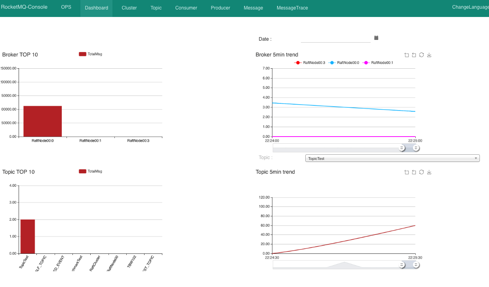

以看到各个Broker的分组，哪些是Master，哪些是Slave，他们各自的机器地址和端口号，还有版本号。包括最重要的，就是他们每台机器的生产消息TPS和消费消息TPS，还有消息总数。这是非常重要的，**通过这个TPS统计，就是每秒写入或者被消费的消息数量，就可以看出RocketMQ集群的TPS和并发访问量**。

另外在界面右侧有两个按钮，一个是“状态”，一个是“配置”。其中点击状态可以看到这个Broker更加细节和具体的一些统计项，点击配置可以看到这个Broker具体的一些配置参数的值。

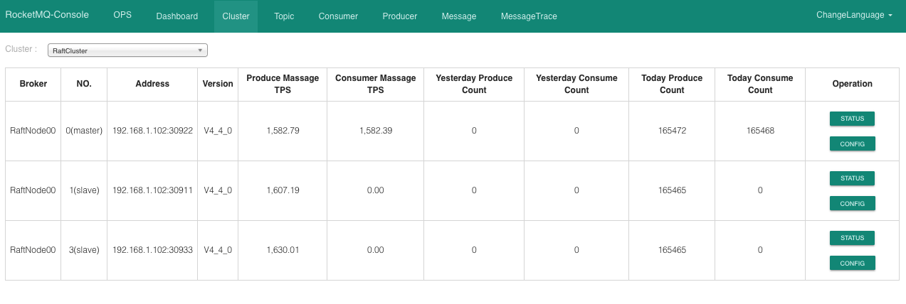

通过这个界面就可以对Topic进行管理了，比如你可以在这里创建、删除和管理Topic，查看Topic的一些装填、配置，等等，可以对Topic做各种管理。

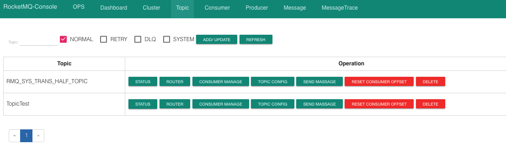

接着点击导航栏里的“消息”和“消息轨迹”，又可以对消息进行查询和管理

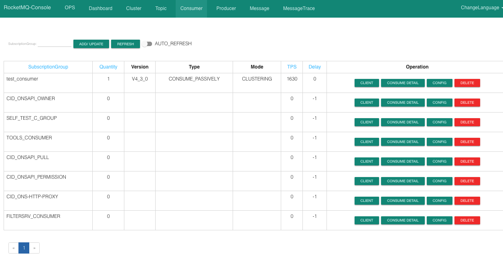

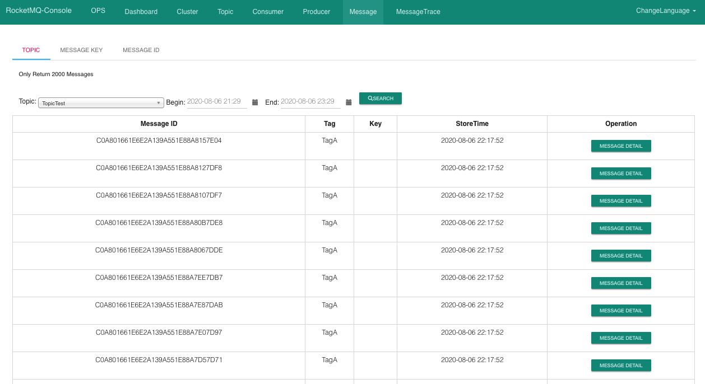


### 2.10 参数调优

第一步，你需要对他部署的机器的OS内核参数进行一定的调整（也就是linux操作系统的一些内核参数）。因为OS内核参数很多默认值未必适合生产环境的系统运行，有些参数的值需要调整大一些，才能让中间件发挥出来性能。

第二步，比如RocketMQ、MyCat、Elasticsearch、Kafka之类的东西，很多都是Java开发的，或者是基于JVM的Scala开发的。需要对JVM进行合理的优化配置

第三步，就是中间件系统自己本身的一些核心参数的设置，比如你的中间件系统会开启很多线程处理请求和工作负载，然后还会进行大量的网络通信，同时会进行大量的磁盘IO类的操作。

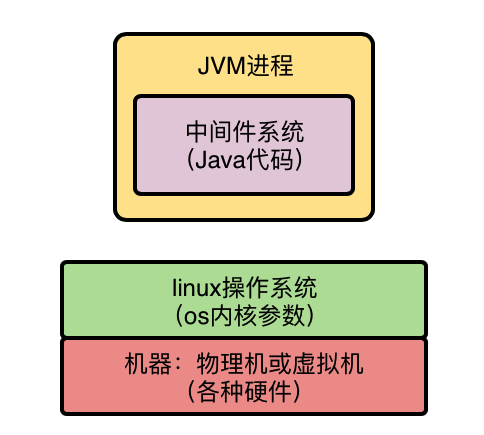

#### OS参数调优

**vm.overcommit_memory**

“vm.overcommit_memory”这个参数有三个值可以选择，0、1、2。

如果值是0的话，在你的中间件系统申请内存的时候，os内核会检查可用内存是否足够，如果足够的话就分配内存给你，如果感觉剩余内存不是太够了，干脆就拒绝你的申请，导致你申请内存失败，进而导致中间件系统异常出错。

**参数的值调整为1，意思是把所有可用的物理内存都允许分配给你，只要有内存就给你来用，这样可以避免申请内存失败的问题。**

```shell
echo 'vm.overcommit_memory=1' >> /etc/sysctl.conf
```


**vm.max_map_count**

这个参数的值会影响中间件系统可以开启的线程的数量，同样也是非常重要的。如果这个参数过小，有的时候可能会导致有些中间件无法开启足够的线程，进而导致报错，甚至中间件系统挂掉。他的默认值是65536，但是这个值有时候是不够的，比如我们大数据团队的生产环境部署的Kafka集群曾经有一次就报出过这个异常，说无法开启足够多的线程，直接导致Kafka宕机了。

```shell
echo 'vm.max_map_count=655360' >> /etc/sysctl.conf。
```


**vm.swappiness**

这个参数是用来控制进程的swap行为的，这个简单来说就是os会把一部分磁盘空间作为swap区域，然后如果有的进程现在可能不是太活跃，就会被操作系统把进程调整为睡眠状态，把进程中的数据放入磁盘上的swap区域，然后让这个进程把原来占用的内存空间腾出来，交给其他活跃运行的进程来使用。

+ 如果这个参数的值设置为0，意思就是尽量别把任何一个进程放到磁盘swap区域去，尽量大家都用物理内存。
+ 如果这个参数的值是100，那么意思就是尽量把一些进程给放到磁盘swap区域去，内存腾出来给活跃的进程使用。
+ **默认这个参数的值是60，有点偏高了，可能会导致我们的中间件运行不活跃的时候被迫腾出内存空间然后放磁盘swap区域去。**

因此通常在生产环境建议把这个参数调整小一些，比如设置为10，尽量用物理内存，别放磁盘swap区域去。

```shell
echo 'vm.swappiness=10' >> /etc/sysctl.conf
```


**ulimit**

这个是用来控制linux上的最大文件链接数的，默认值可能是1024，一般肯定是不够的，因为你在大量频繁的读写磁盘文件的时候，或者是进行网络通信的时候，都会跟这个参数有关系

对于一个中间件系统而言肯定是不能使用默认值的，如果你采用默认值，很可能在线上会出现如下错误：error: too many open files。

```shell
echo 'ulimit -n 1000000' >> /etc/profile
```


#### JVM参数调优

runbroker.sh脚本，在里面可以看到如下内容

```shell
JAVA_OPT="${JAVA_OPT} -server -Xms8g -Xmx8g -Xmn4g"
JAVA_OPT="${JAVA_OPT} -XX:+UseG1GC -XX:G1HeapRegionSize=16m -XX:G1ReservePercent=25 -XX:InitiatingHeapOccupancyPercent=30 -XX:SoftRefLRUPolicyMSPerMB=0"
JAVA_OPT="${JAVA_OPT} -verbose:gc -Xloggc:/dev/shm/mq_gc_%p.log -XX:+PrintGCDetails -XX:+PrintGCDateStamps -XX:+PrintGCApplicationStoppedTime -XX:+PrintAdaptiveSizePolicy"
JAVA_OPT="${JAVA_OPT} -XX:+UseGCLogFileRotation -XX:NumberOfGCLogFiles=5 -XX:GCLogFileSize=30m"
JAVA_OPT="${JAVA_OPT} -XX:-OmitStackTraceInFastThrow"
JAVA_OPT="${JAVA_OPT} -XX:+AlwaysPreTouch"
JAVA_OPT="${JAVA_OPT} -XX:MaxDirectMemorySize=15g"
JAVA_OPT="${JAVA_OPT} -XX:-UseLargePages -XX:-UseBiasedLocking"
JAVA_OPT="${JAVA_OPT} -Djava.ext.dirs=${JAVA_HOME}/jre/lib/ext:${BASE_DIR}/lib"
#JAVA_OPT="${JAVA_OPT} -Xdebug -Xrunjdwp:transport=dt_socket,address=9555,server=y,suspend=n"
JAVA_OPT="${JAVA_OPT} ${JAVA_OPT_EXT}"
JAVA_OPT="${JAVA_OPT} -cp ${CLASSPATH}"
```

其实就是在为启动Broker设置对应的JVM参数和其他一些参数，我们可以把其中JVM相关的参数抽取出来给大家解释

```shell
-server -Xms8g -Xmx8g -Xmn4g -XX:+UseG1GC -XX:G1HeapRegionSize=16m -XX:G1ReservePercent=25 -XX:InitiatingHeapOccupancyPercent=30 -XX:SoftRefLRUPolicyMSPerMB=0 -verbose:gc -Xloggc:/dev/shm/mq_gc_%p.log -XX:+PrintGCDetails -XX:+PrintGCDateStamps -XX:+PrintGCApplicationStoppedTime -XX:+PrintAdaptiveSizePolicy -XX:+UseGCLogFileRotation -XX:NumberOfGCLogFiles=5 -XX:GCLogFileSize=30m -XX:-OmitStackTraceInFastThrow -XX:+AlwaysPreTouch -XX:MaxDirectMemorySize=15g -XX:-UseLargePages -XX:-UseBiasedLocking
```


**-server**：这个参数就是说用服务器模式启动，这个没什么可说的，现在一般都是如此

**-Xms8g -Xmx8g -Xmn4g**：这个就是很关键的一块参数了，也是重点需要调整的，就是默认的堆大小是8g内存，新生代是4g内存，根据机器调整

**-XX:+UseG1GC -XX:G1HeapRegionSize=16m**：这几个参数也是至关重要的，这是选用了G1垃圾回收器来做分代回收，对新生代和老年代都是用G1来回收。这里把G1的region大小设置为了16m，这个因为机器内存比较多，所以region大小可以调大一些给到16m，不然用2m的region，会导致region数量过多的

**-XX:G1ReservePercent=25**：这个参数是说，在G1管理的老年代里预留25%的空闲内存，保证新生代对象晋升到老年代的时候有足够空间，避免老年代内存都满了，新生代有对象要进入老年代没有充足内存了。默认值是10%，略微偏少，这里RocketMQ给调大了一些

**-XX:InitiatingHeapOccupancyPercent=30**：这个参数是说，当堆内存的使用率达到30%之后就会自动启动G1的并发垃圾回收，开始尝试回收一些垃圾对象。**默认值是45%，这里调低了一些，也就是提高了GC的频率**，但是避免了垃圾对象过多，一次垃圾回收耗时过长的问题

**-XX:SoftRefLRUPolicyMSPerMB=0**：这个参数默认设置为0了，在JVM优化专栏中，救火队队长讲过这个参数引发的案例，其实建议这个参数不要设置为0，避免频繁回收一些软引用的Class对象，这里可以调整为比如1000

**-verbose:gc -Xloggc:/dev/shm/mq_gc_%p.log -XX:+PrintGCDetails -XX:+PrintGCDateStamps -XX:+PrintGCApplicationStoppedTime -XX:+PrintAdaptiveSizePolicy -XX:+UseGCLogFileRotation -XX:NumberOfGCLogFiles=5 -XX:GCLogFileSize=30m**：这一堆参数都是控制GC日志打印输出的，确定了gc日志文件的地址，要打印哪些详细信息，然后控制每个gc日志文件的大小是30m，最多保留5个gc日志文件。

**-XX:-OmitStackTraceInFastThrow**：这个参数是说，有时候JVM会抛弃一些异常堆栈信息，因此这个参数设置之后，就是禁用这个特性，要把完整的异常堆栈信息打印出来

**-XX:+AlwaysPreTouch**：这个参数的意思是我们刚开始指定JVM用多少内存，不会真正分配给他，会在实际需要使用的时候再分配给他

**-XX:MaxDirectMemorySize=15g**：这是**说RocketMQ里大量用了NIO中的direct buffer，这里限定了direct buffer最多申请多少**，如果你机器内存比较大，可以适当调大这个值，如果有朋友不了解direct buffer是什么，可以自己查阅一些资料。

**-XX:-UseLargePages -XX:-UseBiasedLocking**：这两个参数的意思是禁用大内存页和偏向锁，这两个参数对应的概念每个要说清楚都得一篇文章，所以这里大家直接知道人家禁用了两个特性即可。

最后我们做一点小的总结，RocketMQ默认的JVM参数是采用了**G1垃圾回收器****，默认堆内存大小是8G**


#### RocketMQ参数调优

集群部署的时候给大家提过，在下面的目录里有dledger的示例配置文件：rocketmq/distribution/target/apache-rocketmq/conf/dledger

在这里主要是有一个较为核心的参数：**sendMessageThreadPoolNums=16**

这个参数的意思就是RocketMQ内部用来发送消息的线程池的线程数量，**默认是16，根据机器CPU核数调整**


### 2.11 压力测试

在压测的时候一方面要关注RocketMQ能抗下多少TPS，一方面还要关注RocketMQ部署的几台机器的资源使用率和负载情况。

比如RocketMQ集群在抗下10万TPS（可以理解为每秒处理10万条消息）的同时，结果机器的CPU负载达到100%，内存几乎消耗殆尽，IO负载极高，网卡流量打满甚至快要打爆，此时你觉得这个10万TPS的成本是不是太高了？

因为眼看着你抗下了超高的TPS，结果自己机器资源消耗殆尽，几乎机器都快挂了，那么你在真正的生产环境能放心的允许RocketMQ集群抗到10万TPS吗。**显然是不行的，因为在机器快挂掉的情况下让中间件抗超高的负载是绝对不行的。**

主要关注的还是要压测出来一个最合适的最高负载。意思就是**在RocketMQ的TPS和机器的资源使用率和负载之间取得一个平衡。**

比如RocketMQ集群在机器资源使用率极高的极端情况下可以扛到10万TPS，但是**当他仅仅抗下8万TPS的时候，你会发现cpu负载、内存使用率、IO负载和网卡流量，都负载较高，但是可以接受，机器比较安全，不至于宕机**。那么这个8万TPS实际上就是最合适的一个最高负载，也就是说，哪怕生产环境中极端情况下，RocketMQ的TPS飙升到8万TPS，你知道机器资源也是大致可以抗下来的，不至于出现机器宕机的情况。

所以做压测，其实最主要的是综合TPS以及机器负载，尽量找到一个最高的TPS同时机器的各项负载在可承受范围之内，这才是压测的目的。


#### RocketMQ的TPS和消息延时

我们让**两个Producer不停的往RocketMQ集群发送消息，每个Producer所在机器启动了80个线程**，相当于每台机器有80个线程并发的往RocketMQ集群写入消息。

而RocketMQ集群是1主2从组成的一个dledger模式的高可用集群，只有一个Master Broker会接收消息的写入。

然后有**2个Cosumer不停的从RocketMQ集群消费数据。。每条数据的大小是500个字节**，**这个非常关键**，大家一定要牢记这个数字，因为这个数字是跟后续的**网卡流量**有关的。

我们发现，**一条消息从Producer生产出来到经过RocketMQ的Broker存储下来，再到被Consumer消费，基本上这个时间跨度不会超过1秒钟，这些这个性能是正常而且可以接受的**。

同时在RocketMQ的管理工作台中可以看到，Master Broker的TPS（也就是每秒处理消息的数量），可以稳定的达到7万左右，也就是每秒可以稳定处理7万消息。


#### cpu负载情况

其次我们检查了一下Broker机器上的CPU负载，可以通过top、uptime等命令来查看。比如执行top命令就可以看到cpu load和cpu使用率，这就代表了cpu的负载情况。在你执行了top命令之后，往往可以看到如下一行信息：

```
load average：12.03，12.05，12.08
```

类似上面那行信息代表的是cpu在1分钟、5分钟和15分钟内的cpu负载情况

比如我们一台机器是24核的，那么上面的12意思就是有12个核在使用中。换言之就是还有12个核其实还没使用，cpu还是有很大余力的。

这个**cpu负载其实是比较好的，因为并没有让cpu负载达到极限。**


#### 内存使用率

使用free命令就可以查看到内存的使用率，根据当时的测试结果，机器上48G的内存，仅仅使用了一部分，还剩下很大一部分内存都是空闲可用的，或者是被RocketMQ用来进行磁盘数据缓存了。


#### JVM GC频率

使用jstat命令就可以查看RocketMQ的JVM的GC频率，基本上新生代每隔几十秒会垃圾回收一次，每次回收过后存活的对象很少，几乎不进入老年代


#### 磁盘IO负载

接着可以检查一下磁盘IO的负载情况。首**先可以用top命令查看一下IO等待占用CPU时间的百分比**，你执行top命令之后，会看到一行类似下面的东西：

```shell
Cpu(s): 0.3% us, 0.3% sy, 0.0% ni, 76.7% id, 13.2% wa, 0.0% hi, 0.0% si
```


如果这个比例太高，说明CPU执行的时候大部分时间都在等待执行IO，也就说明IO负载很高，导致大量的IO等待。

这个当时我们压测的时候，**是在40%左右，说明IO等待时间占用CPU执行时间的比例在40%左右，这是相对高一些，但还是可以接受的，只不过如果继续让这个比例提高上去，就很不靠谱了，因为说明磁盘IO负载可能过高了。**


#### 网卡流量

使用如下命令可以查看服务器的网卡流量：

```shell
sar -n DEV 1 2
```

通过这个命令就可以看到每秒钟网卡读写数据量了。当时我们的服务器使用的是千兆网卡，千兆网卡的理论上限是每秒传输128M数据，但是一般实际最大值是每秒传输100M数据。

因此当时我们发现的一个问题就是，**在RocketMQ处理到每秒7万消息的时候，每条消息500字节左右的大小的情况下，每秒网卡传输数据量已经达到100M了，就是已经达到了网卡的一个极限值了。**


因为一个Master Broker服务器，每秒不光是通过网络接收你写入的数据，还要把数据同步给两个Slave Broker，还有别的一些网络通信开销。因此实际压测发现，每条消息500字节，每秒7万消息的时候，服务器的网卡就几乎打满了，无法承载更多的消息了。


#### 压测的一点小总结

最后针对本次压测做一点小的总结，实际上经过压测，最终发现我们的服务器的性能瓶颈在网卡上，因为网卡每秒能传输的数据是有限的

因此当我们使用**平均大小为500字节的消息时，最多就是做到RocketMQ单台服务器每秒7万的TPS，而且这个时候cpu负载、内存负载、jvm gc负载、磁盘io负载**，基本都还在正常范围内。

只不过这个时候网卡流量基本已经打满了，无法再提升TPS了。因此在这样的一个机器配置下，RocketMQ一个比较靠谱的TPS就是7万左右。

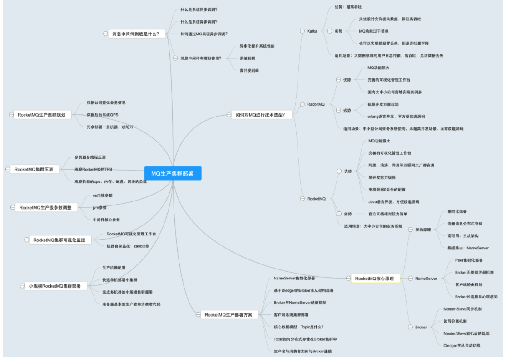