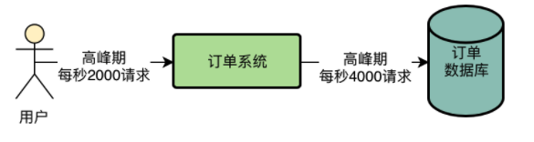

# 消息中间件实战高手

## 1. 订单系统的技术挑战

### 1.1 业务流程

+ 当用户对购物车中选中的一批商品确认下单的时候，会先出来一个确认订单的界面
+ 用户得先确认这个订单中的商品、价格、运费无误，而且在这个过程中可以选择是否要使用优惠券、促销活动的。
+ 用户还应该在这个界面中确认自己的快递方式，收件地址，是否要开发票以及发票的抬头是什么。
+ 当用户完成这些信息确认之后，就可以确定下单。

### 1.2 系统流程

订单系统最核心的一个环节就出现了，就是要根据APP端传递过来的种种信息，完成订单的创建，此时需要在数据库中创建对应的订单记录，

+ 正式确认下单之后，除了在数据库中创建这个订单之外
+ 会跳转到支付界面，让你通过选择好的支付方式完成这个订单的支付。比如跳转到支付宝或者微信，让你在支付宝或者微信中完成支付，
+ 在完成了支付之后，一般来说，支付宝或者微信之类的支付系统，会反过来回调我们的一个接口，通知我们本次支付已经成功。
+ 当我们收到支付成功的通知之后，就需要安排给用户进行配送发货。
+ 因为一般电商APP都经常会做一些鼓励用户购买的活动，比如你购买之后送一些优惠券，下次购买可以抵用5块钱，或者给你发一个几块钱的现金红包。此外，还会给你发送一个push推送，通知你支付成功准备发货，这个推送很多时候是通过短信通知的。

### 1.3 核心模块

+ 首先订单系统在完成核心的下单业务流程之后，用户一定会**查询订单**，那么订单系统务必要提供对应的订单查询功能。
+ **下单模块**主要是用于创建订单
+ **异步模块**主要是在支付成功之后发优惠券、红包和推送，查询模块主要是提供订单的查询。
+ 订单系统中也得提供**退货功能**，在下面的图中我们加入退货模块。
+ 订单系统跟**第三方系统的对接。**
+ 订单数据是一个公司的核心数据，很多时候公司内部的其他团队，比如**大数据团队可能就需要获取订单数据进行分析**
+ 在类似双11、秒杀等大促场景下，等待一些特价促销的商品开卖之后进行抢购，此时可能会对订单系统会产生一个流量洪峰，甚至影响正常的一些下单功能。往往要提供一个专门用于抗双11、秒杀等活动的**大促模块，专门用于处理特殊活动下的高并发下单场景**

### 1.4 系统压力

活跃的用户数量是一两百万的样子，然**后每天新增的订单数量，目前大概是几十万的样子**。

在一些双11、618等大促活动的时候，我们现在的订单系统就可以达到单日**百万订单的量级了**，所以我们的系统压力还是比较大的。

QPS，也就是系统每秒的查询数量，这个指标是说订单系统所有的核心以及非核心功能模块加起来，每秒钟有多少请求量。

+ 在往常每天的高峰期，大概最多会达到**每秒2000左右的访问量**，不算太大。

+ 但是如果要是有那种特价商品限时秒杀的活动，那**可能就会达到每秒1万以上的访问压力**了。

  

压力主要在两方面：

- 一方面是订单系统日益增长的数据量
- 一方面是在大促活动时每秒上万的访问压力

### 1.5 性能瓶颈

系统每天高峰期**大概会有2000左右的QPS,也就是每秒会有2000左右的请求过来,这就是当前系统的个最大压力**。在非高峰的时候,其实远远达不到这么高的并发,所以先考志高峰期的压力就可以了。

一个系统的工程师来说,应该了解的事情就是你的APP用户的生活习惯和APP的使用习惯，这些用户的使用惯直接决定了他们使用我们APP的频率，时间段和时长。

通过线上ー些数据的统计，**我们大致知道,咱们这个APP,基本上80%的用户都习惯于在晩上六点过后到凌晨十ー点这几个小时使用**，所以在这儿个小时内,可以认为有80万左石的用户会使用APP。因此对我们订单系统而言，主要的访问量就是下订单以及对订单的索，査询，少量的退款等渠作。

因为我们的电商AP有两个特点，第一，真实的系统访问负载应该是一个半园形的曲线,类似下面这样。

比如从晚上6点开始访问量开始加，一直到可能晚上把几点到一个顶点,访问是最大的然后慢慢的开始下落,到上十一点就变得较低。

现在线上的**订单系统一共部署了8台机器,每台机器的配置是4核8G**。因此高峰期每台机器的请求大概是每秒200~300之间。

但是这8台订单系统部署的服务器都是连接一台数据库服务器的,**数据库服务器的配置是16核32G**,而且是SSD同态硬莅的,用的是比
较高配置比较贵的机器,因此性能会更好一些。

现在线上这样的一个机器部著情況,**在高峰期毎秒2000以上请求的情況下是很轻松可以抗住的**。因为4核8G的机器一般每秒钟抗几百请求都没

然后数据库服务器因为用的是**16核32G的配置,因此之前压测的时候知道他即使每秒上万请求也能做到,只不过那个已经是他的极限**了,会导致数据库服务器的CPU，磁盘，网络，IO，内存的使用率几乎达到极限。现在数据库服务器在高峰期的每秒请求量也就是三四千的样子因此基本上还没什么大问题。

这八个步骤全部执行完，加起来大概需要1秒~2秒的时间。**高峰期数据库的负载较高，会导致数据库磁盘，IO, CPU负载很高，导致数据库执行SQL语句下降**，导致用户等待时间过长。

### 1.6 技术难点

#### 第三方系统耦合度高

订单退款应该是一个订单支付的逆向过程，也就是说他应该做如下一些事：

+ 重新给商品增加库存
+ 更新订单状态为“已完成”
+ 减少你的积分
+ 收回你的优惠券和红包
+ 发送Push告诉你退款完成了
+ 通知仓储系统取消发货
+ 需要通过第三方支付系统把钱重新退还给你。

那这个退款流程太长，子步骤过多，如果用户点击退款之后要一下子执行这么多步骤，可能需要好几秒的时间，用户体验同样是很差的！

**有可能是第三方支付系统自己的问题导致退款失败**，也可能是你在调用第三方支付系统的时候，因为你自己的网络问题导致调用失
败，就退款失败了。

如果发现超过24小时还没付款，**就直接把订单状态改成“已关闭”了，释放掉锁定的那些商品库存**。假设咱们现在数据库中积压了几十万笔待支付的订单，**难道你要求一个后台线程不停的去扫描这几十万笔订单吗？这个效率明显是很低的啊！**

#### 大数据查询订单数据

想知道昨天一共有多少个用户在我们这里购买了商品？一共有多少笔订单？每个商品分别卖了多少件？哪个商品是打印最火爆卖的最好的？我们的APP昨天有多少人打开了？打开APP的人里有多少人下订单购物了？我们昨天的毛利润一共有多少（就是营业额扣除掉商品本身的成本之后的毛利，如果你用毛利再减去公司运营的成本，比如300个员工的工资，公司房租、水电等等，再交完税，就是老板和股东的净利润了）？

昨天下订单购物的人里，老用户有多少人（就是以前在你这里注册过或者购物过的，这些算老用户）？新用户有多少人（就是第一次下载你的APP，注册之后立马就购物的用户）？才能继续去考虑公司的运营策略。

大数据团队收集数，比如用户搜索了什么东西，点击了什么东西，评论了什么东西。还有就是搜集用户在APP里的交易数据，比如最核心的一种订单数据。订单数据就直观的代表了用户在APP里的所有的交易。然后大数据团队搜集过来大量的数据之后，就形成了所谓的“大数据”。接着他用这些大数据可以计算出很多东西。

最常见的就是数据报表，比如说用户行为报表，订单分析报表。

大数据团队从我们这里提取数据，已经严重影响到我们订单系统的运行了。现在我们的订单数据库，是直接对外暴露的，大数据团队是直接可以访问我们的订单数据库的。

他们有一个数据报表系统，那个系统每次在老板查看交易报表的时候，就会直接用一个几百行的大SQL，从我们的订单数据库里查出来
需要的数据！**数据报表系统运行一个几百行的大SQL到我们库里，这种级别的SQL在这种量级下，快则三五秒，慢则几十秒！**

每次当有几十个几百行的大SQL同时运行在我们订单数据库里的时候，**都会导致我们的数据库CPU负载很高，磁盘IO负载很高！**一旦我们的数据库负载很高，**直接会导致我们的订单系统执行的一些增删改查的操作性能大幅度下降！**

#### 促销活动的洪峰流量

如每秒订单系统的各类接口被调用2000次，平均每个接口会执行多少次数据库操作？一般你可以认为平均每个接口会执行2~3次的数据库操作。

一般一个接口根据业务复杂度的不同，有的接口可能处理一个请求要执行五六次数据库操作，有的接口可能是1次数据库操作+两三个其他系统的接口调用（比如库存系统、营销系统）。总之，一般来说，业务系统的接口处理逻辑，基本都集中在对自己的数据库的操作以及对其他系统的调用上。

所以大致在我们这里，结合线上数据库的可视化监控界面，基本可以知道，**平均每次订单系统的接口调用，会执行2次数据库操作，我们观察数据库的监控界面，在最高峰的时候，每秒大概是有4000左右的请求。**

公司现在积累的注册用户已经千万级了，平时的日活用户都百万级，今年的双11参与活动的用户预计有可能会达到两三百万。假设是这个量级的话，基本可以做一个设想，如果有200万用户参与双11活动，在双11购物最高峰的时候，肯定会比往年的高峰QPS高好几倍，预计有可能今年双11最高峰的时候，会达到每秒至少1万的QPS。

也就是说，光**是系统被请求的QPS就会达到1万以上，那么系统请求数据库的QPS就会达到2万以上**。仅仅凭借我们目前的数据库性能，是无论如何扛不住每秒2万请求的。

## 2. Rocket MQ 生产部署架构

### 2.1 MQ核心功能

#### 异步

那么在这种情况下，用户发起一个请求，系统A收到请求，接着系统A必须立马去调用系统B，直到系统B返回了，系统A才能返回结果给用户，**这种模式其实就是所谓的“同步调用”**。

“消息中间件”叫MQ就行了，英文全称就是“Message Queue”，也就是消息队列。

一个核心的概念就是“消息”。所以系统A一般会发送一个消息给MQ。

+ 系统A就认为自己的工作干完了，然后就直接返回结果给用户了。
+ 系统B根据自己的情况，可能会在系统A投递消息到MQ之后的1秒内，也可能是1分钟之后，也可能是1小时之后，多长时间都有可能，反正不管是多长时间后，系统B肯定会从MQ里获取到一条属于自己的消息。然后获取到消息之后，根据消息的指示再完成自己的工作。

#### 解耦

现在假设系统A要调用系统B干一个事儿，然后系统A先执行一些操作，需要耗费20ms，接着系统B执行一些操作要耗费200ms，总共就要耗费220ms。给用户要等待220ms。

那么如果在系统A和系统B之间加一个MQ。系统A干完自己的事情，就20ms，然后发送一个消息到MQ，就5ms，然后就直接返回结果给用户了。也就是说，用户仅仅等待25ms就收到了结果。

#### 削峰

然后系统B是要操作一台数据库服务器的，**那台数据库的上限是接收每秒6000请求**，那么系统B无论部署多少台机器都没用，因为他依赖的数据库最多只能接收每秒6000请求。

现在假设大量用户同时发起访问，系统A会瞬间把1万QPS转发给系统B，假设你系统B也部署20台机器，系统B自己可以抗住1万QPS，**数据库是抗不下来1万QPS的**，此时系统B如果对数据库发起1万QPS的请求，一定会瞬间压垮数据库的。

+ MQ这个技术抗高并发的能力远远高于数据库，同样的机器配置下，如果数据库可以抗每秒6000请求，MQ至少可以抗每秒几万请求。

+ 数据库他要能够支持你执行复杂的SQL语句，支持事务等复杂的机制，支持你对数据进行增删改查，所以一**般数据库单服务器也就支撑每秒几千的请求。**

系统b只要慢慢的从MQ里获取消息然后执行数据库读写操作即可，这个**获取消息的速度是系统B自己可以控制的**，所以系统B完全可以用一个比较低的速率获取消息然后写入数据库，保证对数据库的QPS不要超过他的极限值6000。

### 2.2 MQ选型

#### Kafka的优势和劣势

**Kafka的吞吐量几乎是行业里最优秀的**，在常规的机器配置下，一台机器可以达到每秒十几万的QPS，相当的强悍。

Kafka性能也很高，基本上**发送消息给Kafka都是毫秒级的性能。可用性也很高**，Kafka是可以支持集群部署的，其中部分机器宕机是可以继续运行的。

**Kafka有丢数据方面的问题**，因为Kafka收到消息之后会写入一个磁盘缓冲区里，并没有直接落地到物理磁盘上去，所以要是机器本身故障了，可能会导致磁盘缓冲区里的数据丢失。

**Kafka功能非常的单一**，主要是支持发送消息给他，然后从里面消费消息，其他就没有什么额外的高级功能了。所以基于Kafka有限的功能，可能适用的场景并不是很多。

因此综上所述，以及查阅了Kafka技术在各大公司里的使用，基本行业里的一个标准，是把Kafka用在用户行为日志的采集和传输上，比如大数据团队要收集APP上用户的一些行为日志，这种日志就是用Kafka来收集和传输的。而且一般量特别大，要求吞吐量要高，一般就是收发消息，不需要太多的高级功能，所以Kafka是非常适合这种场景的。

#### RabbitMQ的优势和劣势

**RabbitMQ的优势在于可以保证数据不丢失，也能保证高可用性**，即集群部署的时候部分机器宕机可以继续运行，然后**支持部分高级功能，比如说死信队列，消息重试之类的**，这些是他的优点。

**RabbitMQ的吞吐量是比较低的**，一般就是每秒几万的级别，所以如果遇到特别特别高并发的情况下，支撑起来是有点困难的。

另外还有一个较为致命的缺陷，就是他的开发语言是erlang，国内很少有精通erlang语言的工程师，因此也没办法去阅读他的源代码，甚至修改他的源代码。

很多中小型公司觉得RabbitMQ基本可以满足自己的需求还在继续使用中，因为中小型公司并不需要特别高的吞吐量，RabbitMQ已经足以满足他们的需求了，而且也不需要部署特别大规模的集群，也没必要去阅读和修改RabbitMQ的源码。

#### RocketMQ的优势和劣势

RocketMQ是阿里开源的消息中间件，他几乎同时解决了Kafka和RabbitMQ的缺陷。

**RocketMQ的吞吐量也同样很高，单机可以达到10万QPS以上，而且可以保证高可用性，性能很高**，而且支持通过配置保证数据绝对不丢失，可以部署大规模的集群，还支持各种高级的功能，比如说**延迟消息、事务消息、消息回溯、死信队列、消息积压**，等等。

**RocketMQ是基于Java开发的**，符合国内大多数公司的技术栈，很容易就可以阅读他的源码，甚至是修改他的源码。所以现在国内很多一线互联网大厂都切换为使用RocketMQ了，他们需要RocketMQ的高吞吐量，大规模集群部署能力，以及各种高阶的功能去支撑自己的各种业务场景，同时还可以根据自己的需求定制修改RocketMQ的源码。

RocketMQ是非常适合用在Java业务系统架构中的，因为他很高的性能表现，还有他的高阶功能的支持，可以让我们解决各种业务问题。

RocketMQ的官方文档相对简单一些，但是Kafka和RabbitMQ的官方文档就非常的全面和详细，这可能是RocketMQ目前唯一的缺点。

| Messaging Product | Client SDK           | Protocol and Specification                           | Ordered Message                                              | Scheduled Message | Batched Message                                 | BroadCast Message | Message Filter                                          | Server Triggered Redelivery | Message Storage                                              | Message Retroactive                          | Message Priority | High Availability and Failover                               | Message Track | Configuration                                                | Management and Operation Tools                               |
| :---------------- | :------------------- | :--------------------------------------------------- | :----------------------------------------------------------- | :---------------- | :---------------------------------------------- | :---------------- | :------------------------------------------------------ | :-------------------------- | :----------------------------------------------------------- | :------------------------------------------- | :--------------- | :----------------------------------------------------------- | :------------ | :----------------------------------------------------------- | :----------------------------------------------------------- |
| ActiveMQ          | Java, .NET, C++ etc. | Push model, support OpenWire, STOMP, AMQP, MQTT, JMS | Exclusive Consumer or Exclusive Queues can ensure ordering   | Supported         | Not Supported                                   | Supported         | Supported                                               | Not Supported               | Supports very fast persistence using JDBC along with a high performance journal，such as levelDB, kahaDB | Supported                                    | Supported        | Supported, depending on storage,if using kahadb it requires a ZooKeeper server | Not Supported | The default configuration is low level, user need to optimize the configuration parameters | Supported                                                    |
| Kafka             | Java, Scala etc.     | Pull model, support TCP                              | Ensure ordering of messages within a partition               | Not Supported     | Supported, with async producer                  | Not Supported     | Supported, you can use Kafka Streams to filter messages | Not Supported               | High performance file storage                                | Supported offset indicate                    | Not Supported    | Supported, requires a ZooKeeper server                       | Not Supported | Kafka uses key-value pairs format for configuration. These values can be supplied either from a file or programmatically. | Supported, use terminal command to expose core metrics       |
| RocketMQ          | Java, C++, Go        | Pull model, support TCP, JMS, OpenMessaging          | Ensure strict ordering of messages,and can scale out gracefully | Supported         | Supported, with sync mode to avoid message loss | Supported         | Supported, property filter expressions based on SQL92   | Supported                   | High performance and low latency file storage                | Supported timestamp and offset two indicates | Not Supported    | Supported, Master-Slave model, without another kit           | Supported     | Work out of box,user only need to pay attention to a few configurations | Supported, rich web and terminal command to expose core metrics |

### 2.3 RocketMQ架构原理

#### 高并发

RocketMQ是可以集群化部署的，可以部署在多台机器上。假设每台机器都能抗10万并发，然后你只要让几十万请求分散到多台机器上就可以了，让每台机器承受的QPS不超过10万不就行了。

#### 分布式存储

RocketMQ存储海量消息的机制就是分布式的存储。所谓分布式存储，就是把数据分散在多台机器上来存储，每台机器存储一部分消息，这样多台机器加起来就可以存储海量消息了！

#### 高可用

RocketMQ的解决思路是Broker主从架构以及多副本策略。

Master Broker收到消息之后会同步给Slave Broker，这样Slave Broker上就能有一模一样的一份副本数据。这样同一条消息在RocketMQ整个集群里不就有两个副本了，一个在Master Broker里，一个在Slave Broker里！

这个时候如果任何一个Master Broker出现故障，还有**一个Slave Broker上有一份数据副本，可以保证数据不丢失**，还能继续对外提供服务，保证了MQ的可靠性和高可用性

#### 数据路由

RocketMQ有一个NameServer的概念，他也是独立部署在几台机器上的，然后所有的Broker都会把自己注册到NameServer上去，NameServer就知道集群里有哪些Broker了。

然后对于我们的系统而言，如果他要发送消息到Broker，会找NameServer去获取路由信息，就是集群里有哪些Broker等信息

### 2.4 路由中心

NameServer一定会多机器部署，实现一个集群，起到高可用的效果，保证任何一台机器宕机，其他机器上的NameServer可以继续对外提供服务！**每个Broker启动都得向所有的NameServer进行注册**

RocketMQ中的生产者和消费者就是这样，**自己主动去NameServer拉取Broker信息的**。

每个NameServer都知道集群里有这么一台Broker的存在了，**然后各个系统从NameServer那儿也拉取到了Broker信息**，也知道集群里有这么一台Broker

**Broker跟NameServer之间有心跳机制**，Broker会每隔30s给所有的NameServer发送心跳，告诉每个NameServer自己目前还活着。120s没发心跳给NameServer，就认为broker宕机了。

### 2.5 主从架构

#### 主从复制

先来看第一个问题，我们都知道，为了保证MQ的数据不丢失而且具备一定的高可用性，所以一般都是得将Broker部署成Master-Slave模式的，也就是一个Master Broker对应一个Slave Broker

RocketMQ的Master-Slave模式采取的是**Slave Broker不停的发送请求到Master Broker去拉取消息**。

#### 读写分离

**有可能从Master Broker获取消息，也有可能从Slave Broker获取消息**

作为消费者的系统在获取消息的时候会先发送请求到Master Broker上去，请求获取一批消息，此时Master Broker是会返回一批消息给消费者系统的

​       

然**后Master Broker在返回消息给消费者系统的时候，会根据当时Master Broker的负载情况和Slave Broker的同步情况，向消费者系统建议下一次拉取消息的时候是从Master Broker拉取还是从Slave Broker拉取**。

+ 例子一，Master Broker负载很重，本身要抗10万写并发了，你还要从他这里拉取消息，给他加重负担，那肯定是不合适的。所以此时Master Broker就会建议你从Slave Broker去拉取消息。
+ 例子二，Master Broker上都已经写入了100万条数据了，结果Slave Broke不知道啥原因，同步的特别慢，才同步了96万条数据，落后了整整4万条消息的同步，这个时候你作为消费者系统可能都获取到96万条数据了，那么下次还是只能从Master Broker去拉取消息。因为Slave Broker同步太慢了，导致你没法从他那里获取更新的消息了。

#### 主备切换

RocketMQ 4.5版本之前，都是用Slave Broker同步数据，尽量保证数据不丢失，但是一旦Master故障了，Slave是没法自动切换成Master

在RocketMQ 4.5之后，因为RocketMQ支持了一种新的机制，叫做**Dledger**，基于Raft协议实现的一个机制。

旦Master Broker宕机了，就可以在多个副本，也就是多个Slave中，**通过Dledger技术和Raft协议算法进行leader选举**，直接将一个Slave Broker选举为新的Master Broker，**然后这个新的Master Broker就可以对外提供服务了**。整个过程也许只要10秒或者几十秒的时间就可以完成。